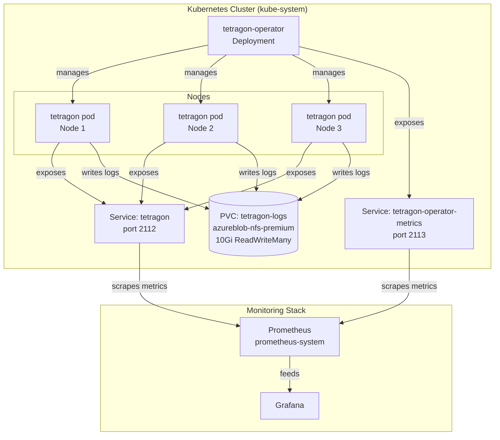

# Tetragon - Runtime Security Observability

## Table of Contents
- [Overview](#overview)
- [Architecture](#architecture)
- [Prerequisites](#prerequisites)
- [Installation](#installation)
- [Configuration](#configuration)
- [Custom Resources](#custom-resources)
- [Updating Tetragon](#updating-tetragon)
- [Maintenance](#maintenance)
- [Troubleshooting](#troubleshooting)
- [References](#references)

---

## Overview
Tetragon provides runtime security observability for Kubernetes clusters using eBPF. It monitors system calls, network activity, and file access to detect and respond to security threats.

### Key Features
- Real-time monitoring of system calls and network traffic
- File access monitoring for protected directories
- Integration with Prometheus and Grafana for visualization
- Lightweight and efficient using eBPF technology
- Persistent storage for logs using PVC

### Components
- **Tetragon Agent**: Runs on each node as a DaemonSet to monitor system calls and network traffic.
- **Tetragon Operator**: Manages the lifecycle of Tetragon agents.
- **Export Stdout**: Sidecar container for exporting logs to stdout.
- **Grafana Dashboard**: Visualizes security events and metrics.

---

## Architecture

### High-Level Overview


### Data Flow

1. **Collection**: Tetragon agent on each node monitors system calls and file access via eBPF.
2. **Log Export**: Each pod's `tetragon` container writes logs to `/var/run/cilium/tetragon/{NODE_NAME}/tetragon.log` on the PVC; the `export-stdout` sidecar streams to stdout.
3. **Storage**: All logs persist in the shared `tetragon-logs` PVC (azureblob-nfs-premium, 10Gi, ReadWriteMany) with node-isolated subdirectories.
4. **Metrics**: Agent pods expose metrics on port 2112; operator exposes on port 2113.
5. **Scraping**: Prometheus discovers and scrapes both Services via ServiceMonitor in `prometheus-system` namespace.
6. **Operator Management**: Tetragon operator Deployment manages TracingPolicy CRDs and agent configuration.
7. **Visualization**: Grafana queries Prometheus to render the pre-configured security observability dashboard.

---

## Prerequisites

### Kubernetes Cluster

* Kubernetes 1.20 or later
* eBPF support enabled on nodes (`ls /sys/fs/bpf`)

### Tools

* Helm 3.x
* kubectl
* Kustomize (for customizations)

### Storage

* PersistentVolume (PV) for storing logs (see `pvc.yaml`)

---

## Installation

### Manual Deployment

```bash
kustomize build --enable-helm kustomize/raw-manifests/tetragon | kubectl apply -f -

```

### Deployment Approach

* Tetragon is deployed using the official Helm chart (v1.6.1) with customizations applied via Kustomize.
* Custom resources (TracingPolicies, dashboards, network policies) are applied alongside the Helm chart.
* Container images are pulled from the internal registry: `artifactory.cloud.statcan.ca/docker-quay-remote`

---

## Configuration

### Values File

Customize Tetragon using the `values.yaml` file. Key settings include:

### Log Export & Storage

```yaml
tetragon:
  config:
    exportFilePath: /var/run/cilium/tetragon/$(NODE_NAME)/tetragon.log
    exportFileMaxSizeMb: 100
    exportFileMaxBackups: 3
    exportFileCompress: true

```

#### Resource Limits

```yaml
tetragon:
  resources:
    requests:
      cpu: 100m
      memory: 256Mi
    limits:
      cpu: 500m
      memory: 512Mi

```

#### Image Registry

```yaml
tetragon:
  image:
    repository: artifactory.cloud.statcan.ca/docker-quay-remote/cilium/tetragon
    tag: v1.6.1

```

---

## Custom Resources

### TracingPolicies

Security tracking is handled by a consolidated core policy file under `policies/`:

* `tetragon-basic-policies.yaml`: Implements the `admin-and-package-ops-audit` policy. Uses eBPF kprobes (`sys_execve`, `sys_openat`) to track administrative tool executions, package manager operations, and access to sensitive system files.

### Other Resources

* **Grafana Dashboards** (`grafana/`) - Contains `tetragon-dashboard.yaml`, which provisions the `Tetragon Security Overview v19` ConfigMap in the `prometheus-system` namespace. This sets up a dual-tier state timeline view for critical privilege changes and runtime deviations.
* **NetworkPolicy** (`netpol.yaml`) - Restricts ingress to allow only Prometheus scraping.
* **PodDisruptionBudget** (`poddisruptionbudget.yaml`) - Ensures high availability during maintenance.
* **PersistentVolumeClaim** (`pvc.yaml`) - Stores logs on Azure Blob NFS premium storage.

---

## Updating Tetragon

To upgrade Tetragon to a new version:

1. **Update `kustomization.yaml`**: Change the `version` field in the `helmCharts` section.
2. **Update `values.yaml`**: Modify resource limits, replicas, or other configurations as needed.
3. **Commit & Push**: Git commits trigger ArgoCD to automatically sync the changes.

To rollback, revert the version number in `kustomization.yaml` and ArgoCD will automatically deploy the previous version.

---

### Upgrade Procedure

Tetragon uses Kustomize for centralized version management. All versions are defined in `kustomize/raw-manifests/tetragon/kustomization.yaml`.

#### Upgrading Tetragon Version

1. Edit `kustomize/raw-manifests/tetragon/kustomization.yaml`
2. Update the `newTag` values for the Tetragon images:
   - `cilium/tetragon` (agent)
   - `cilium/tetragon-operator` (operator)
   - `cilium/hubble-export-stdout` (log exporter, optional)
3. Update the version in the `labels` section (for resource labels)
4. Commit and push to the target branch
5. ArgoCD will automatically detect changes and sync

#### Example: Upgrade from 1.6.1 to 1.6.2

```yaml
# kustomize/raw-manifests/tetragon/kustomization.yaml
labels:
  - includeSelectors: true
    pairs:
      app.kubernetes.io/version: "1.6.2"  # Updated

images:
  - name: artifactory.cloud.statcan.ca/docker-quay-remote/cilium/tetragon
    newTag: v1.6.2  # Updated
  - name: artifactory.cloud.statcan.ca/docker-quay-remote/cilium/tetragon-operator
    newTag: v1.6.2  # Updated
  - name: artifactory.cloud.statcan.ca/docker-quay-remote/cilium/hubble-export-stdout
    newTag: v1.1.0
```

---

## Maintenance

### Log Rotation

Tetragon logs are rotated automatically based on the settings in `values.yaml`:

* `maxSizeMB`: Maximum log file size (default: 100 MB)
* `maxBackups`: Number of log backups to retain (default: 3)
* `compress`: Compress log backups (default: true)

### Cleanup

To clean up Tetragon resources:

```bash
kubectl delete -k kustomize/raw-manifests/tetragon

```

### Backup

Backup custom resources and values:

```bash
# Backup custom resources
kubectl get tracingpolicies -n kube-system -o yaml > tracingpolicies-backup.yaml

# Backup values
cp values.yaml values-backup.yaml

```

---

## Troubleshooting

### Common Issues

#### Pods Not Starting

* **Check eBPF Support**: Ensure the node has eBPF support:
```bash
ls /sys/fs/bpf

```


* **Verify Image Access**: Ensure the Tetragon image is accessible:
```bash
docker pull artifactory.cloud.statcan.ca/docker-quay-remote/cilium/tetragon:v1.6.1

```


#### High CPU/Memory Usage

* **Adjust Resource Limits**: Modify CPU/memory requests and limits in `values.yaml`.
* **Reduce Monitoring Scope**: Review Tetragon configuration to reduce the number of monitored events.

#### Log Rotation Issues

* **Verify Permissions**: Check log file permissions:
```bash
kubectl exec -n kube-system <tetragon-pod> -- ls -l /var/run/cilium/tetragon

```


* **Check Disk Space**: Ensure there is enough disk space:
```bash
kubectl exec -n kube-system <tetragon-pod> -- df -h

```


#### Probe Failures

* **Check Logs**: Inspect Tetragon logs for errors:
```bash
kubectl logs -n kube-system <tetragon-pod-name>

```


* **Verify Metrics Endpoint**: Test the metrics endpoint:
```bash
kubectl exec -n kube-system <tetragon-pod> -- curl http://localhost:2112/metrics

```

---

## References

### Documentation

* [Tetragon Documentation](https://tetragon.io/docs/)
* [eBPF and Kubernetes](https://cilium.io/blog/2021/05/11/ebpf-kubernetes/)
* [Kubernetes Pod Security Context](https://kubernetes.io/docs/tasks/configure-pod-container/security-context/)

### Related Files

* `kustomization.yaml`: Kustomize configuration for deploying Tetragon.
* `values.yaml`: Custom values for the Tetragon Helm chart.
* `policies/tetragon-basic-policies.yaml`: Unified policy tracking binaries and critical system files.
* `netpol.yaml`: Network policy for restricting ingress traffic.
* `poddisruptionbudget.yaml`: Pod Disruption Budget for high availability.
* `pvc.yaml`: PersistentVolumeClaim for storing logs.
* `grafana/tetragon-dashboard.yaml`: Grafana dashboard configuration for combined telemetry.
